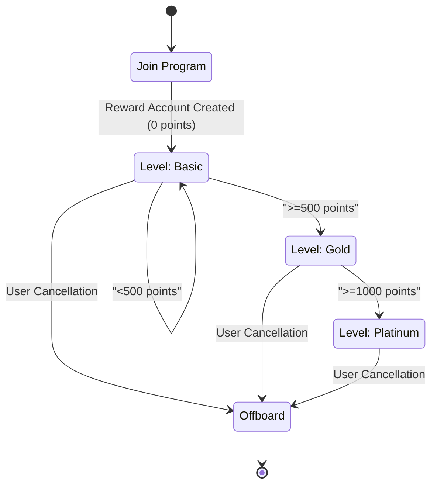

# Temporal Take Home Assessment

A customer loyalty program built on Temporal.

## User journey

This diagram depicts the user lifecycle of in the customer reward program.

## TODOs

- [x] Learn more about how customer reward program is designed for companies (e.g. Starbucks)
  - [Starbucks Rewards](https://www.starbucks.com/rewards) includes redeeming merchandise
  - [Marriott Bonvoy](https://help.marriott.com/s/article/Article-22331) post points within 72 hours after stay
- [x] Design workflow (e.g. activities, signal, update, timer, etc.)
- [ ] Identify test cases (e.g. good, failure, edge cases)
- [ ] Bootstrap development environment
- [ ] Write code
- [ ] Write test
- [ ] Iterate
