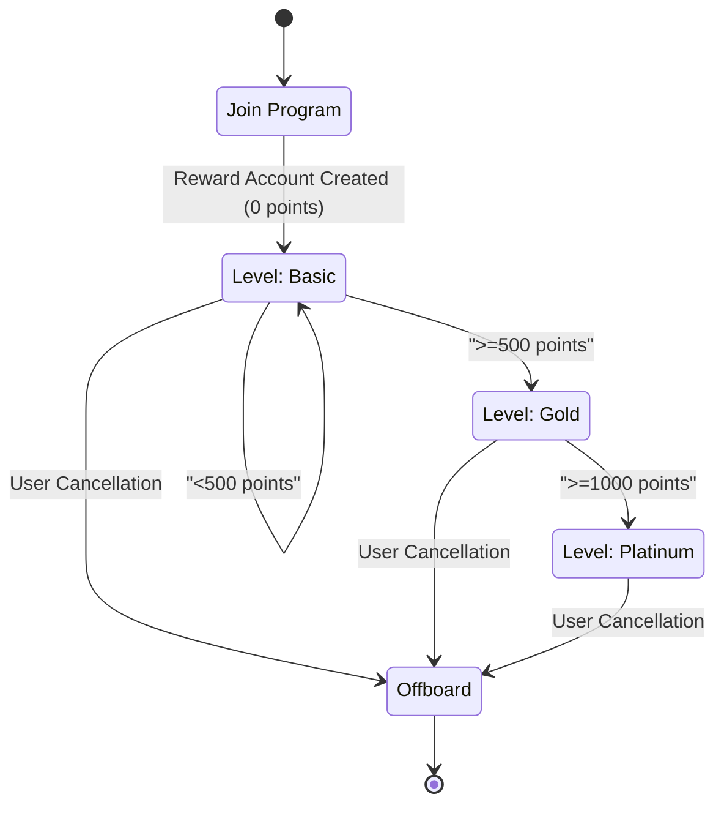

# Temporal Take Home Assessment

A customer loyalty program built on Temporal.

## User journey

This diagram depicts the user lifecycle of in the customer reward program.



## Getting started

1. Start Temporal cluster locally

    ```bash
    temporal server start-dev
    ```

1. Start worker program.

    ```bash
    uv run src/run_worker.py
    ```

1. Run Temporal workflow.

    ```bash
    uv run src/workflows.py
    ```


## TODOs

- [x] Learn more about how customer reward program is designed for companies (e.g. Starbucks)
  - [Starbucks Rewards](https://www.starbucks.com/rewards) includes redeeming merchandise
  - [Marriott Bonvoy](https://help.marriott.com/s/article/Article-22331) post points within 72 hours after stay
- [x] Design workflow (e.g. activities, signal, update, timer, etc.)
- [x] Identify test cases (e.g. good, failure, edge cases)
  - Good path
    - Given user has not enrolled in the reward program, when an user joins the reward program, then they have basic level and 0 point.
    - Given user takes part in the reward program, when an user make a purchase, then they earn X (e.g. $1-to-1) points.
    - Given user has 499 points, when an user make a $1 purchase, then they should have 500 points and are promoted to gold level.
    - Given user has 999 points, when an user make a $1 purchase, then they should have 1000 points and are promoted to platinum level.
    - Given user has 0 points, when an user make a $1000 purchase, then they should have 1000 points and are promoted to platinum level.
    - Given user has 0 points, when a client queries the user account, then the client receive user status of basic level and 0 points.
    - Given user has 499 points, when a client queries the user account, then the client receive user status of basic level and 499 points.
    - Given user has 500 points, when a client queries the user account, then the client receive user status of gold level and 500 points.
    - Given user has 501 points, when a client queries the user account, then the client receive user status of gold level and 501 points.
    - Given user has 999 points, when a client queries the user account, then the client receive user status of gold level and 999 points.
    - Given user has 1000 points, when a client queries the user account, then the client receive user status of platinum level and 1000 points.
    - Given user has `MAX_INT` points, when a client queries the user account, then the client receive user status of platinum level and `MAX_INT` points.
    - Given user has enrolled in the reward program, when the user requests to leave the program, then their reward program becomes inactive.
  - Failure path
    - Given user has enrolled in the reward program, when an user joins the reward program, then the operation should fail.
    - Given user has not enrolled in the reward program, when a client queries the user account, then the operation should fail.
    - Given user has not enrolled in the reward program, when the user requests to leave the program, then the operation should fail.
- [x] Bootstrap development environment
- [ ] Write code
- [ ] Write test
- [ ] Iterate
